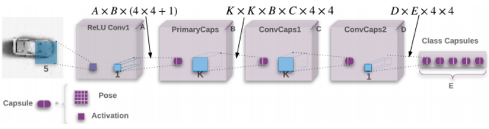

## Matrix Capsules with EM Routing - Understanding

This documents my understanding of the recent __matrix capsules__ framework proposed in [Matrix Capsules with EM Routing](https://openreview.net/pdf?id=HJWLfGWRb).

This document assumes you already familiar with the convolution neural network framework, e.g., how conv2d, conv3d works, what are vgg, inception, resnet, and etc.

It would be beneficial to understand of the __vector capsules__ structure, described in [Dynamic Routing Between Capsules](https://arxiv.org/abs/1710.09829), although not necessary.   

### Overview

I would value the matrix capsules with EM routing contributes to the current deep learning framework with the following 3 aspects:

1. The __matrix capsules__ use a pose matrix (4x4) and activation (scalar), instead of one scalar number, as the basic unit to describe the activities of hidden features or output.

    Furthermore, compared to the vector capsules, the matrix capsules use a matrix of $$n$$ elements, rather than a vector of length $$n$$, so its viewpoint transformation matrix requires just $$n$$ parameter, rather than $$n^2$$ in the vector capsules.

1. This work introduces a convolution operation between the capsule layers, e.g., between the adjacent layers of (poses, activations), so that it is possible to build __deep__ networks.

    The previous vector capsules paper introduces only fully-connected operations between capsule layers.

1. This work proposes an EM routing algorithm to route weights between inputs capsules and output capsules.
 
    This EM routing algorithm is more physically and statistically solid than the routing by agreement (agreement on cosine angle) introduced in the vector capsules.   

Let's define some notations before diving into the matrix capsules framework.

### The Notations

1. __A Regular Layer__: Tensor with shape __[N, H, W, C]__, where often N is the number of samples e.g., batch_size, H is the height, W is the width, and C is the number of channels. For example, in MNIST, each image is 28x28, with a single channel, so a batch size of 128 images would lead to an input tensor of [128, 28, 28, 1].

1. __A Regular Kernel__: Tensor with shape __[KH, KW, I, O]__, where often KH is the kernel height, KW is the kernel width, I is the number of input channels, and O is the number of output channels, e.g., a 5x5 convolution kernel on the previous [128, 28, 28, 1] to provide 32 ouptut channels would require a kernel shape [5, 5, 1, 32]. Of course, we also need strides to determine the height and width of the output layer.

1. __A Matrix Capsule Layer__: Tensor tuple of __(poses: [N, H, W, C, PH, PW], activations: [N, H, W, C])__, where PH is the pose height, and PW is the pose width. This is an extension from the regular layers to include poses and activations in representing a feature or an object. In the paper, matrix capsules with EM routing, PH = PW = 4.

1. __A Matrix Capsule Kernel__: Tensor with shape __[KH, KW, I, O, PH, PW]__. This kernel is used in __the matrix capsules convolution operation__ to convert an inputs matrix capsule layer __(poses: [N, H, W, I, PH, PW], activations: [N, H, W, I])__ into and output matrix capsule layer __(poses: [N, OH, OW, O, PH, PW], activations: [N, OH, OW, O])__. Here, OH is the output height, OW is the output width, and OH and OW are determined by the KH, KW and strides.

Let's build a neural network with matrix capsules.

### The Framework

For clarity, let's name each layer as IL (input layer), AL, BL, CL, DL, and EL, from left to right. In the paper, the author uses A, B, C, D, E to represent the number of channels at each layer in above figure. I add a postfix __L__ to distinguish between the name of layer from the number of channels of that layer.

In addition, I assume we use the MNIST dataset with a batch_size __N=128__, set __A=32__, __B=48__, __C=64__, __D=80__, and __E=10__, so that we can distinguish between each layers.

#### An overview of the framework

1. Layer IL: MNIST, a batch_size 128, [128, 28, 28, 1].

1. IL -> AL (A=32): kernel [5, 5, 1, 32], strides [1, 2, 2, 1], padding SAME, ReLU. This is a regular convoluation operation connects IL to AL.

1. Layer AL: [128, 14, 14, 32].

1. AL -> BL (B=48): kernel [1, 1, 32, 48] x (4 x 4 + 1), strides [1, 1, 1, 1]. 16 such kernels of [1, 1, 32, 48] for building poses, and 1 such kernel [1, 1, 32, 48] for building activation. This is the __initialization operation to connect a regular layer to a matrix capsule layer__, implemented in __capsule_init()__ with details in next section.

1. Layer BL: poses [N=128, H=14, W=14, B=48, PH=4, PW=4], activations [N=128, H=14, W=14, B=48].

1. BL -> CL (C=64): kernel [KH=3, KW=3, B=48, C=64, PH=4, PW=4], e.g., KH = KW = 3. strides, [1, 2, 2, 1]. This is the __convolution operation between matrix capsule layer__, implemented in __capsule_conv()__ with details in next section.

1. Layer CL: poses [N=128, H=6, W=6, C=64, PH=4, PW=4], activation [N=128, H=6, W=6, C=64]

1. CL -> DL (D=80): kernel [3, 3, 64, 80, 4, 4], strides [1, 1, 1, 1].

1. Layer DL: posed [128, 4, 4, 80, 4, 4], activations [128, 4, 4, 80]

1. DL -> EL (E=10), kernel [80, 10, 4, 4]. This is the __fully-connected operation with shared view transformation weight matrix between matrix capsule layer__, implemented in __capsule_fc()__ with details in next section.
 
1. Layer EL: poses [128, 10, 4, 4], activations [128, 10].

#### The initialization operation to connect a regular layer to a matrix capsule layer

This operation builds a matrix capsules layer from a regular convolution layer.

Let's assume we have a regular layer of shape [N, IH, IW, I], where IH is the inputs height, IW is the inputs width, and I is the number of inputs channels, and we want to build a matrix capsules layer with kernel [KH, KW, I, O], and strides [1, SH, SW, 1]. Then, we will have a output of a matrix capsules layer of shape (poses [N, OH, OW, O, PH, PW], activations [N, OH, OW, O]), where OH is the output height, OW is the output width, O is the number of output channels, PH is the pose height, and PW is the pose width. Here, OH and OW is determined by the kernel and strides, e.g., KH, KW, SH, SW.

In particular, we can do the regular convolution with PH x PW different kernels of shape [KH, KW, I, O], each produces an output [N, OH, OW, O], we can then stack the PH x PW outputs into [N, OH, OW, O, PH, PW]. This produces the poses. For simplicity, it is equivalent to do a regular convolution with kernel of shape [KH, KW, I, O x PH x PW], obtain an output of shape [N, OH, OW, O x PH x PW], and reshape the output to poses [N, OH, OW, O, PH, PW].

The activation is obtained use same kernel [KH, KW, I, O] and strides [1, SH, SW, 1], no bias added, and tf.sigmoid as activation function.

In the network above, AL -> BL: kernel [1, 1, 32, 48], strides [1, 1, 1, 1], pose shape [4, 4]. Therefore, we apply a regular convolution with kernel [1, 1, 32, 48 x 4 x 4], strides [1, 1, 1, 1] on AL to obtain poses [128, 14, 14, 48, 4, 4], and then apply another regular convolution with kernel [1, 1, 32, 48], strides [1, 1, 1, 1] on AL to obtain activations [128, 14, 14, 48].

#### The convolution operation between matrix capsule layer

This operation builds a matrix capsules layer from another matrix capsules layer. This is the operation provides the capability of building deep neural network with capsule layers.

Let's assume we have a matrix capsules layer of shape (poses [N, IH, IW, I, PH, PW], activations [N, IH, IW, I]), and we want to build a matrix capsules layer with kernel [KH, KW, I, O], and strides [1, SH, SW, 1]. Then, we will have a output of a matrix capsules layer of shape (poses [N, OH, OW, O, PH, PW], activations [N, OH, OW, O]). Here, OH and OW is determined by the kernel and strides, e.g., KH, KW, SH, SW.

In particular, the kernel is in fact in shape [KH, KW, I, O, PH, PW]. At each required position, say (h=0, w=0) of the inputs poses, slice a piece of [N, 0:KH, 0:KW, I, PH, PW], make a dimension expansion to [N, KH, KW, I, 1, PH, PW], __matrix multiplication with the kernel__ as view transform matrix to obtain [N, KH, KW, I, O, PH, PW]. This creates one __votes matrix from KH x KW x I inputs capsules to O outputs with PH x PW dimensions__. In corresponding, the inputs activations for this votes matrix is the slice of [N, 0:KH, 0:KW, I] from the inputs activations. This vote and activation will go into the EM routing algorithm, discussed in next section, and produce an output of pose [N, O, PH, PW] and activation [N, O]. This is the output pose and activation at position (h=0, w=0). The convolution should slide through all required positions determined by kernel and strides, create votes [N, OH, OW, KH, KW, I, O, PH, PW] and i_activations [N, OH, OW, KH, KW, I], reshape votes to [N, OH, OW, KH x KW x I, O, PH x PW] and i_activations to [N, OH, OW, KH x KW x I] for EM routing algorithm, and produce output (poses [N, OH, OW, O, PH, PW], activations [N, OH, OW, O]). Here, assume padding is VALID.

In the network above, BL -> CL: kernel [3, 3, 48, 64], strides, [1, 2, 2, 1]. The above step would create an vote matrix [128, 3, 3, 48, 64, 4, 4] and activations [128, 3, 3, 48]. This vote and activation will go into the EM routing algorithm, discussed in next section, and produce an output of pose [128, 64, 4, 4] and activation [128, 64]. This is the output pose and activation at position (h=0, w=0). The convolution should slide through all required positions determined by kernel and strides, create votes [128, 6, 6, 3, 3, 48, 64, 4, 4] and i_activations [128, 6, 6, 3, 3, 48, 64], reshape votes to [128, 6, 6, 3 x 3 x 48, 64, 4 x 4] and i_activations to [128, 6, 6, 3 x 3 x 48] for EM routing algorithm, and produce output (poses [128, 6, 6, 64, 4, 4], activations [128, 6, 6, 64]). 

#### The fully-connected operation with shared view transformation weight matrix between matrix capsule layer 

This operation builds an output matrix capsules layer from another matrix capsules layer. This operation is better to describe as a fully-connected operation with shared view transformation weight matrix.

In particular, in comparison to the convolution operation above, we should consider the kernel size as the whole inputs H, W. In the convolution operation, the view transformation matrix is different for each capsule in the kernel, which requires a kernel of shape [N, IH, IW, I, O, PH, PW]. However, in this operation, the view transform matrix is shared across capsule in the same channel, so it instead requires a kernel of shape [N, 1, 1, I, O, PH, PW].

__Remark__: This shared view transform matrix is the reason the author use a blue area 1 x 1 in connecting DL to EL in the figure. However, the blue area 1 x 1 is confusing because it would produce a EL of (poses: [128, 4, 4, 10, 4, 4], activations [128, 4, 4, 10]) from DL of poses: [128, 4, 4, 80, 4, 4], activations [128, 4, 4, 80]), by following the same analysis of BL -> CL, and CL -> DL. Here, instead, the blue area should really be H x W, instead 1 x 1, with a special requirement that the view transform matrix is the same across capsules within each channel.

Therefore, make a dimension expansion on inputs poses to [N, IH, IW, I, 1, PH, PW], do matrix multiplication of inputs poses to [N, IH, IW, I, 1, PH, PW] with kernel [N, 1, 1, I, O, PH, PW] produce votes matrix [N, IH, IW, I, O, PH, PW]. This vote and activation will go into the EM routing algorithm, discussed in next section, and produce an output of pose [N, O, PH, PW] and activation [N, O]. 

__Remark__: Add scaled coordinate to the first two elements of votes.

#### A comparison between convolution operation (capsule_conv) and fully-connected with shared view transformation matrix (capsule_fc) between capsules layer.

1. Kernel: 
  
    + capsule_conv kernel [K, K, I, O, PH, PW]
     
    + capsule_fc kernel [1, 1, I, O, PH, PW]

1. Poses to Votes:

    + capsule_conv: slide kernel over the poses, matmul at each required (h, w) position
    
    + capsule_fc: expand kernel to [H, W, I, O, PH, PW] via broadcasting, e.g., share the view transform matrix within each channel, matmul with poses [H, W, I, O, PH, PW]

1. EM Algorithm: 

    + capsule_conv: votes [N, OH, OW, KH x KW x I, O, PH x PW], activations [N, OH, OW, KH x KW x I, O] 

    + capsule_fc: votes [N, IH x IW x I, O, PH x PW], activations [N, IH x IW x I, O]
 
#### The EM Routing Algorithm

Let's assume the inputs are votes [..., KH, KW, I, O, PH, PW] and activations [..., KH, KW, I].

First, reshape VOTES [..., KH x KW x I, O, PH x PW] and ACTIVATIONS [..., KH x KW x I, 1, 1]. Here, KH x KW x I is the number of inputs capsules, O is the number of output capsules, and PH x PW is the number of pose dimensions.

In the network above, BL -> CL, KH = KW = 3, B = 48 (inputs I), C = 64 (output O), PH = PW = 4, then KH x KW x B = 3 x 3 x 48 = 288 inputs capules, C = 64 output capsules, and PH x PW = 4 x 4 = 16 pose dimensions. There is a slight overload on the notation I. In most cases, I and O represent the inputs and output of the two consecutive layers, and only in the very begining I represents the inputs layer literally.

As a result, the EM routing algorithm can be described as:

1. Initialize RR [..., KH x KW x I, O, 1], constant $$1/O$$. This is the routing assigment from each inputs capsule to each output capsule, initialized with a value saying that each inputs routing equally to each output. The sum of each inputs capsules routing assignment to all output capsule is 1.

1. M-Step:

    1. RR' = RR [..., KH x KW x I, O, 1] x ACTIVATIONS [..., KH x KW x I, 1, 1]. Here, RR' [..., KH x KW x I, O, 1] is the activation weighted routing assignment.
    
    1. RR'_SUM = reduce_sum(RR', axis=-3). Here, RR'_SUM [..., 1, O, 1].
    
    1. O_MEAN = reduce_sum(RR' x VOTES, axis=-3) / RR'_SUM. Here, O_MEAN [..., 1, O, PH x PW], mean value for each output capsule at each dimension.
    
    1. O_STDV = reduce_sum(RR' x (VOTES - O_MEAN)^2, axis=-3) / RR'_SUM. O_STDV [..., 1, O, PH x PW], standard deviation value for each output capsule at each dimension.
    
    1. COST_H = ($$\beta_v$$ + log(O_STDV)) x RR'_SUM. Here, COST_H [..., 1, O, PH x PW] is the cost of describing the capsule using mean, with the loss of standard deviation.
    
    1. O_ACTIVATIONS = sigmoid($$\lambda$$($$\beta_a$$ - reduced_sum(COST_H, axis=-1))). Here, O_ACTIVATIONS [..., 1, O, 1] is the activation of each output capsule.
    
1. E-Step:
 
    1. PP = - reduce_sum((VOTES - O_MEAN)^2/(2*O_STDV^2), axis=-1) - reduce_sum(log(O_STDV), axis=-1). Here, PP [..., KH x KW x I, O, 1] is the probability of each inputs capsule is an element of each ouptut capsule.  
    
    2. RR = softmax(PP + log(O_ACTIVATIONS)). Here, RR [..., KH x KW x I, O, 1] is the updated routing assignment matrix from each inputs capsule to each output capsule.

__Remark__:

1. The __reduce_sum requires keep_dims=True__.

1. The E-step is derived from the formula given in the paper with optimizing for computation. This optimization is further discussed in later section.  

