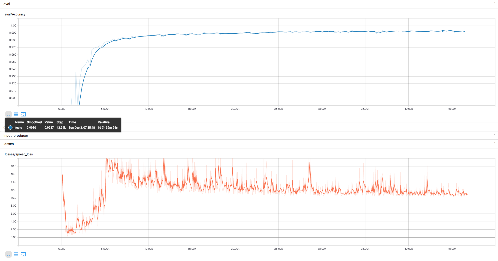

## MNIST

1. Network architecture same as `Matrix Capsules with EM Routing` Figure 1 with A=B=C=D=E=32, iteration=1.

    - Spread loss only, no reconstruction loss.
    
    - Adam Optimizer, learning rate default 0.001, no learning rate decay. 
    
    - Batch size 24 (due to limit of GPU memory), iteration 1. 
    
    - GPU: half K80 12GB memory, 2s-3s per training step.
    
    - Step: 43942, Test Accuracy: __99.37%__.
    
    
    
    __Remark__: Because of `allow_smaller_final_batch=False` and `batch_size=24`, test is running on a random sample 9984 of 10000, so worse case test accuracy could be 99.21%. Modify the `src/datasets/mnist.py` and `src/test.py` to run test on full test dataset.

1. Network architecture same as `Matrix Capsules with EM Routing` Figure 1 with A=B=C=D=E=32, iteration=2, spread loss only, no reconstruction loss.

1. Network architecture same as `Matrix Capsules with EM Routing` Figure 1 with A=B=C=D=E=32, iteration=2, spread loss and reconstruction loss.

1. Network architecture 3x3 conv, 3x3 conv, capsules_init(), capsules_conv() x2, capsules_fc(), iteration=2, spread loss only, no reconstruction loss.

